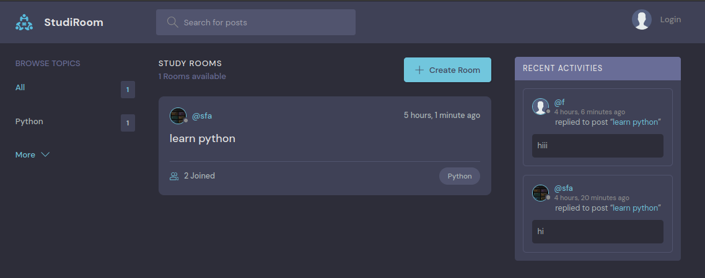
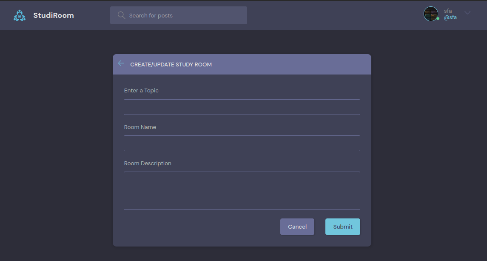
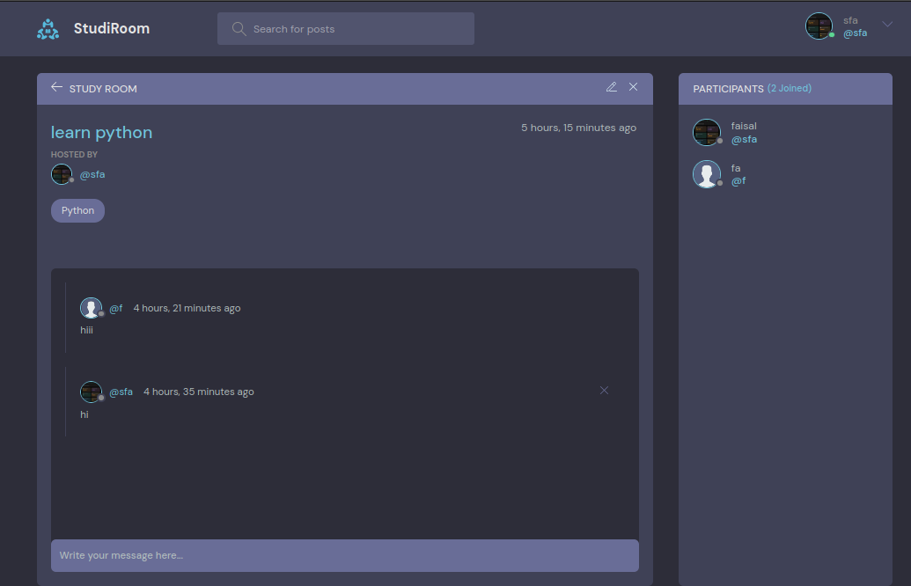
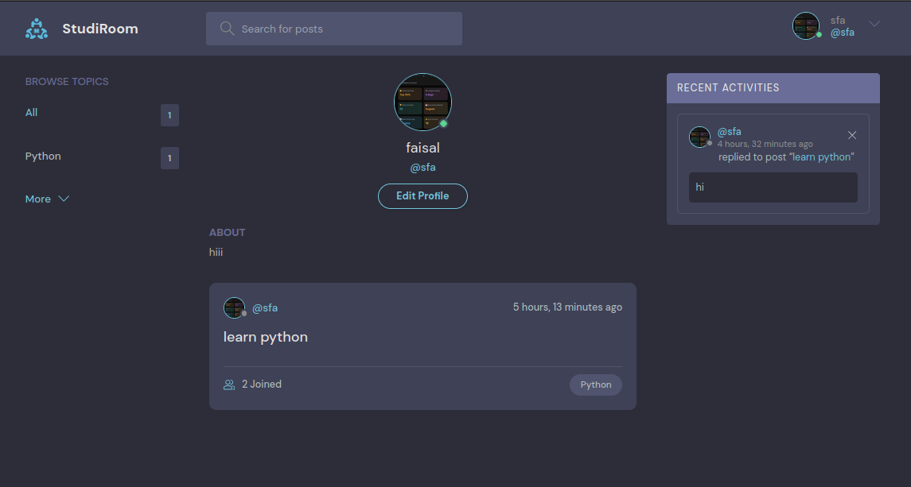
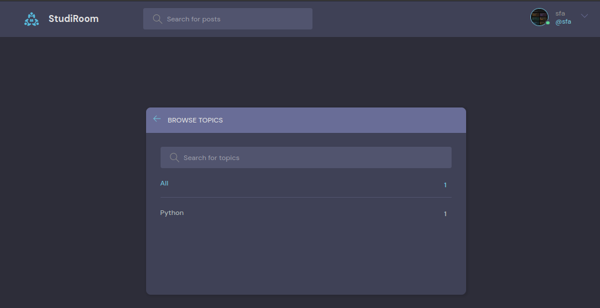

# Django DRF Project

## Project Name
**StudiRoom**

## Description
StudiRoom is a Django-based web application. It provides a platform for users to create and join study groups or discussion rooms focused on learning and collaboration. Users can create rooms, participate in chats, and filter rooms using tags to find groups that match their interests.

The application also features user profiles where users can showcase their bio, profile picture, and view the list of rooms they have created. ALso a RestAPI end point as well using the Django REST Framework (DRF)


## Features
- User Authentication (Login/Registration) using email and password.
- Room Management:
  - Create rooms for study groups or discussions.
  - Join existing rooms and participate in chats.
- User Profiles:
  - View bio, profile picture, and other basic details.
  - List of rooms created by the user.
- Tag-based Filtering:
  - Find rooms using specific tags to match interests.
- Search Functionality:
  - Search for rooms or posts within the platform.
- RestAPI:
  - Create a API end point to get the rooms detail


## Installation
Step-by-step guide to set up the project locally.

1. Clone the repository:
   ```bash
   git clone https://github.com/faisalalisayyed/StudiRoom.git
   cd StudiRoom
   ```

2. Set up a virtual environment:
   ```bash
   python -m venv env
   source env/bin/activate   # On Windows: env\Scripts\activate
   ```

3. Install the dependencies:
   ```bash
   pip install -r requirements.txt
   ```

4. Set up the database:
   ```bash
   python manage.py migrate
   ```

5. Run the development server:
   ```bash
   python manage.py runserver
   ```


## API Endpoints
| Endpoint                      | Method | Description                      |
|-------------------------------|--------|----------------------------------|
| `/api/rooms/`                 | GET    | Fetch list of all rooms          |
| `/api/v1/rooms/<id>/`         | GET    | Fetch particular room by room id |


## Usage
### Get list of all rooms
Example with `curl`:
```bash
curl  -X GET \
  'http://127.0.0.1:8000/api/rooms/'
```

### Get single room detail
```bash
curl  -X GET \
  'http://127.0.0.1:8000/api/rooms/<id>/'
```

## Screenshots

### Home Page


### Room Creation


### Chat Interface


### Profile Interface


### Search Interface

